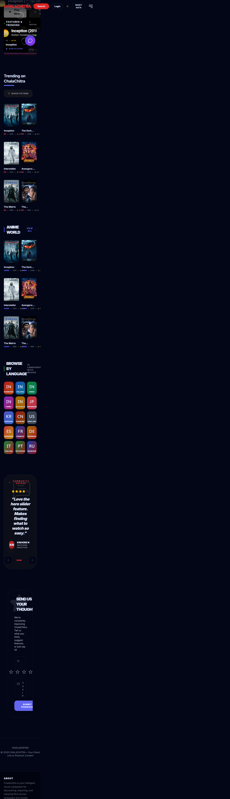
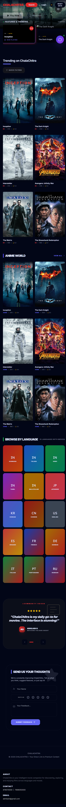
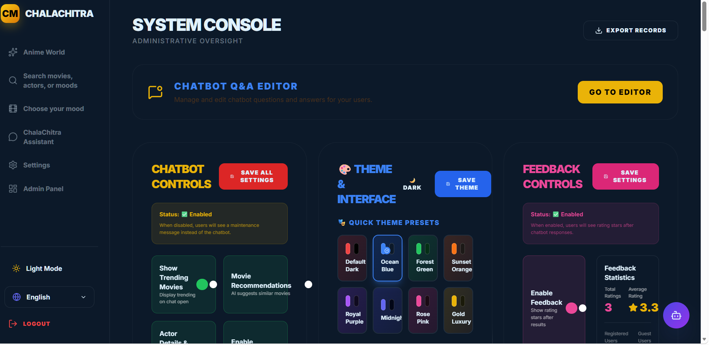
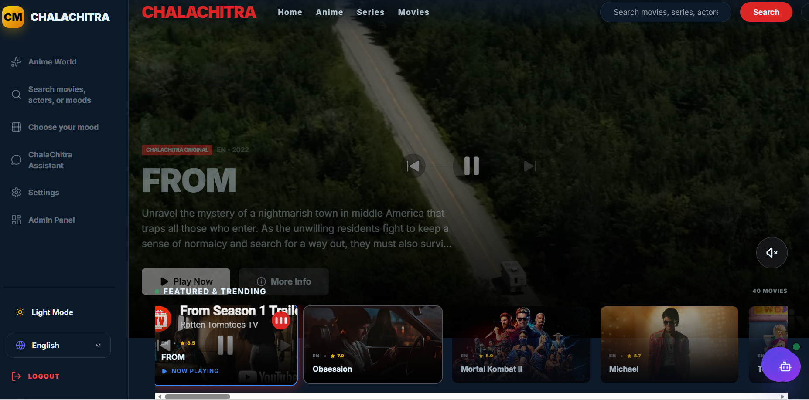
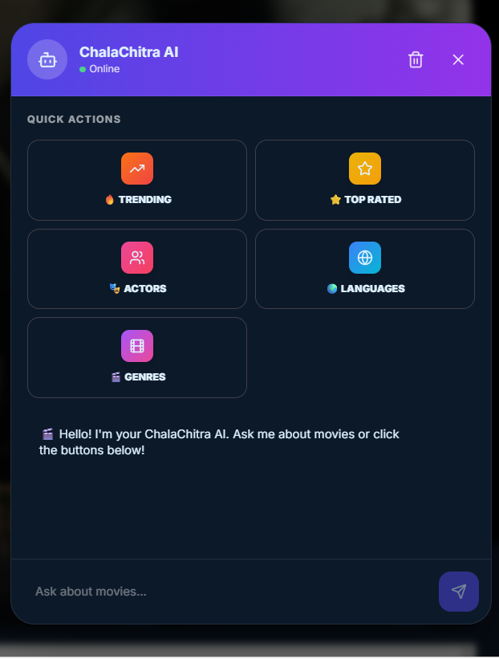
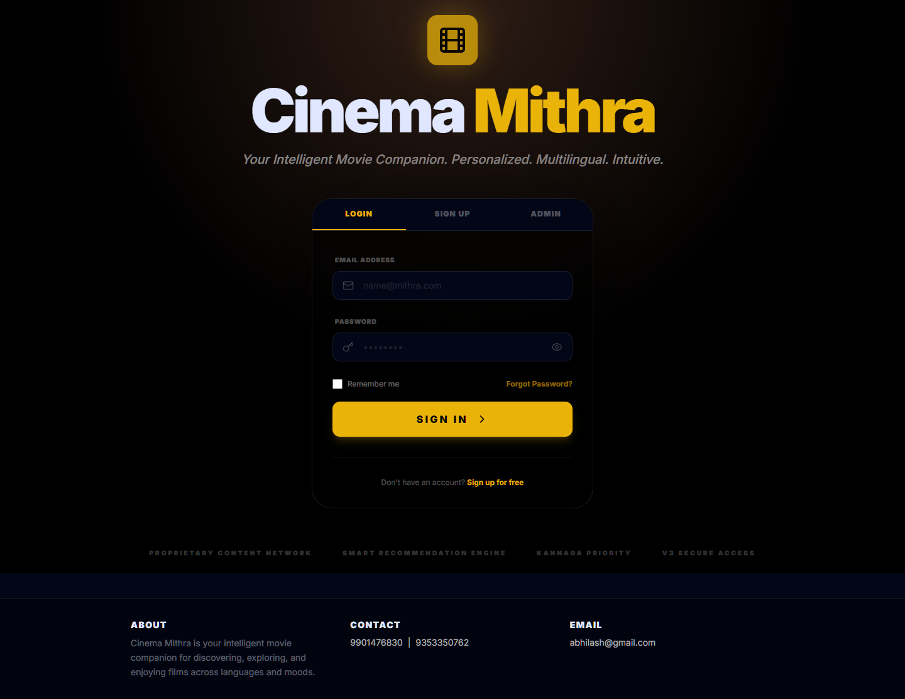
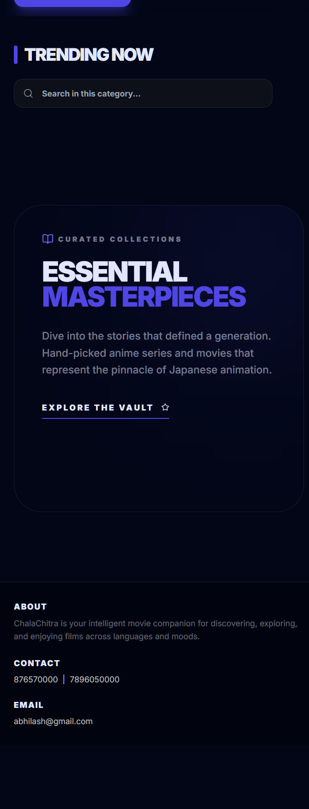

# ChalaChitra

ChalaChitra is an intelligent movie discovery web application. It helps users browse movies and series, search by language or genre, get mood-based recommendations, chat with a movie assistant, view trailers, save preferences, and manage site settings from an admin dashboard.

The project is split into a React frontend, an Express backend, and local SQLite-style storage powered by `sql.js`.

## Project Screenshots & Pages

**Home Page** (`/`) - Featured movies, trending content, language selection, and movie discovery:



**Login Page** (`/login`) - User authentication with Sign In, Register, and Admin tabs:



**Discovery Pages** (`/discover`, `/moods`, `/search`) - Browse by mood, search, and discover movies/series:



**Admin Dashboard** (`/admin`) - Manage movies, series, users, settings, and site configuration:



**Chatbot** (`/chat`) - AI-powered movie assistant for personalized recommendations:



**Account Settings** (`/settings`) - User profile, language preferences, and account security:



**Send Us Your Feedback** (`/feedback`) - Rate ChalaChitra and submit feedback/suggestions:


**Anime World** (`/anime-world`) - Curated anime collection, featured anime, and in-page feedback:



## Pages & Routing

| Page | Route | Type | Description |
|------|-------|------|-------------|
| Home | `/` | Public | Featured movies, trending content, language selector |
| Login | `/login` | Public | Sign In / Register / Admin authentication |
| Discovery | `/discover` | Public | Browse and discover movies/series by category |
| Mood-Based | `/moods` | Protected | Get recommendations based on mood selection |
| Search | `/search` | Public | Search movies and series by title |
| Language | `/language/:langCode` | Public | Browse movies by language |
| Anime World | `/anime-world` | Public | Anime collection with in-page feedback |
| Short Films | `/short-films` | Public | Short film collection |
| Series | `/series` | Public | TV series catalog |
| Chat | `/chat` | Protected | AI chatbot for recommendations |
| Settings | `/settings` | Protected | Account settings and preferences |
| Feedback | `/feedback` | Protected | Submit feedback and rate the app |
| Admin | `/admin` | Admin Only | Manage content, users, and site settings |
| Admin Chatbot | `/admin/chatbot` | Admin Only | Configure chatbot behavior and responses |

**Protected Routes**: Require user authentication. Redirects to `/login` if not authenticated.
**Admin Routes**: Require admin role. Regular users are redirected to home page.

## Frontend

- Location: project root folder.
- Framework: React + Vite + TypeScript.
- Default local URL: `http://localhost:3001`.
- Main entry files: `index.html`, `index.tsx`, `App.tsx`.
- Pages live in `pages/`.
- Shared UI components live in `components/`.
- API/movie helper services live in `services/`.

Run the frontend:

```bash
npm install
npm run dev
```

## Backend

- Location: `server/`.
- Framework: Node.js + Express.
- Default local URL: `http://localhost:3002`.
- Main server files: `server/server.cjs`, `server/routes.js`, `server/db.js`.
- The backend handles API routes, analytics, local user data, and database-backed app features.

Run the backend:

```bash
cd server
npm install
npm run dev
```

## Database

ChalaChitra uses local SQLite-style storage through `sql.js`.

Important database locations:

- Browser/local app storage: user preferences, auth state, settings, and cached app data.
- Backend database file: `server/cinema.db` when created locally.
- Frontend database helpers: `services/simpleDb.ts` and `services/db.ts`.
- Backend database helper: `server/db.js`.

Do not commit `server/cinema.db` if it contains real users, saved API keys, admin settings, or private test data.

## API Keys and TMDB Key

Real API keys should not be committed to GitHub. Add them locally in `.env.local`, in the Admin Dashboard for local settings, or in your deployment provider's secret settings.

Keys used by the app:

- `VITE_TMDB_API_KEY`: Required for live TMDB movie, series, poster, trailer, search, language, anime, and discovery data.
- `VITE_TMDB_BASE_URL`: TMDB base URL. Keep it as `https://api.themoviedb.org/3` unless using a proxy.
- `VITE_GEMINI_API_KEY`: Optional. Enables Gemini-powered chatbot responses and AI recommendations.
- `VITE_OMDB_API_KEY`: Optional. Use only if OMDB metadata features are enabled.
- `TMDB_API_KEY`: Optional backend environment variable. The backend can also read this when running server-side features.
- `OMDB_API_KEY`: Optional backend environment variable.

## Where to Add API Keys

1. Copy `.env.example` to `.env.local`.

   ```bash
   cp .env.example .env.local
   ```

   Windows PowerShell:

   ```powershell
   Copy-Item .env.example .env.local
   ```

2. Open `.env.local` and add your real keys:

   ```env
   VITE_GEMINI_API_KEY=your_real_gemini_api_key
   VITE_TMDB_API_KEY=your_real_tmdb_api_key
   VITE_TMDB_BASE_URL=https://api.themoviedb.org/3
   VITE_OMDB_API_KEY=your_real_omdb_api_key
   ```

3. Restart the frontend after changing `.env.local`.

4. To add the TMDB key from the app, log in as an admin and open the Admin Dashboard. Paste the TMDB key in the API key/settings section. This stores the key in local app settings for that environment.

5. For deployment, add the same keys in your hosting provider's environment variable or secrets page. Do not paste real keys into source files.

## Run the Full Project

Terminal 1, backend:

```bash
cd server
npm install
npm run dev
```

Backend URL:

```text
http://localhost:3002
```

Terminal 2, frontend:

```bash
npm install
npm run dev
```

Frontend URL:

```text
http://localhost:3001
```

## Demo Login

```text
Admin: chalachitra@gmail.com / Admin@1234
User:  user@cinema.com / user123
```

## Static HTML Overview

Open `project-overview.html` directly in a browser to see screenshots, setup notes, frontend/backend details, and API-key instructions without starting the app.

## Build

Create a production build:

```bash
npm run build
```

Preview the production build:

```bash
npm run preview
```

## Before Uploading to GitHub

1. Keep `.env.local` private. It is ignored by Git.
2. Keep `.env.example` as placeholders only.
3. Do not commit `server/cinema.db` if it contains private data.
4. Keep screenshots in `docs/images` so GitHub can render this README.
5. Search for accidental real keys before publishing:

   ```bash
   rg -a "AIza|api_key|VITE_TMDB_API_KEY=.+[A-Za-z0-9]|VITE_GEMINI_API_KEY=.+[A-Za-z0-9]" -g "!node_modules" -g "!dist"
   ```

6. If a real key was ever committed, rotate it in the TMDB, Gemini, or OMDB dashboard. Removing it from the latest files does not remove it from Git history.
